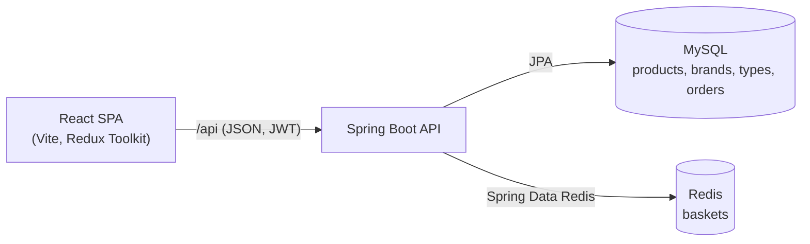

# Sports Center

A full-stack sports e-commerce app: browse a catalog of shoes, rackets, footballs and kit bags, build a basket, sign in, and place orders.

Built with **Spring Boot 3** and **React 18 + TypeScript**, using **MySQL** for catalog and orders and **Redis** for shopping baskets.

## Features

- **Catalog** — server-side pagination, keyword search, brand/type filters, and sorting by name or price
- **Basket** — stored in Redis and keyed by a client-generated id, so guests can shop without an account and the cart survives page reloads
- **Authentication** — stateless JWT auth with Spring Security; the token is attached to API calls automatically and expired sessions are signed out on load
- **Checkout** — validated shipping address form; the server prices the order (including delivery) from the basket, never from client input
- **Order history** — buyers can only see their own orders
- **Polished UI** — Material UI, responsive layout, loading and error states, route-level code splitting

## Tech stack

| Layer | Technologies |
|-------|--------------|
| Backend | Java 17, Spring Boot 3.2, Spring Web, Spring Data JPA, Spring Data Redis, Spring Security, JJWT, Bean Validation |
| Frontend | React 18, TypeScript, Vite, Redux Toolkit, React Router 6, Material UI 5, Axios |
| Data | MySQL 8 (catalog, orders), Redis 7 (baskets) |
| Testing | JUnit 5, Mockito, AssertJ, MockMvc, H2 |
| Tooling | Maven, Docker Compose |

## Architecture



The backend follows a layered design: controllers → services → repositories, with DTOs (Java records) at the API boundary and mappers keeping JPA entities out of responses. Catalog filtering is composed from JPA `Specification`s, and all errors return a consistent JSON body from a global exception handler.

## Getting started

### Prerequisites

- JDK 17+
- Node.js 18+
- Docker Desktop (for MySQL and Redis)

### 1. Start MySQL and Redis

```bash
cd docker
docker compose up -d
```

### 2. Run the API

```bash
./mvnw spring-boot:run
```

The API starts on `http://localhost:8081`. On first startup it seeds sample brands, types, and products when the catalog is empty.

### 3. Run the client

```bash
cd client
npm install
npm run dev
```

Open `http://localhost:5173`. The Vite dev server proxies `/api` to the backend.

### Demo account

```text
username: shopper
password: Password123
```

## API reference

| Method | Endpoint | Auth | Description |
|--------|----------|------|-------------|
| `GET` | `/api/products` | — | Paged catalog; query params `page`, `size`, `sort` (`name`/`price`), `order`, `brandId`, `typeId`, `keyword` |
| `GET` | `/api/products/{id}` | — | Single product |
| `GET` | `/api/brands` | — | All brands |
| `GET` | `/api/types` | — | All product types |
| `GET` | `/api/baskets/{id}` | — | Get a basket |
| `POST` | `/api/baskets/{id}/items` | — | Add a product (`productId`, `quantity`) |
| `PUT` | `/api/baskets/{id}/items/{productId}` | — | Change item quantity |
| `DELETE` | `/api/baskets/{id}/items/{productId}` | — | Remove an item |
| `DELETE` | `/api/baskets/{id}` | — | Delete a basket |
| `POST` | `/api/auth/login` | — | Exchange credentials for a JWT |
| `GET` | `/api/auth/me` | JWT | Current user |
| `POST` | `/api/orders` | JWT | Place an order from a basket (`basketId`, `shippingAddress`) |
| `GET` | `/api/orders` | JWT | The signed-in buyer's orders |
| `GET` | `/api/orders/{id}` | JWT | One of the buyer's orders (another buyer's order returns `404`) |

Send the token as `Authorization: Bearer <token>`.

## Security notes

- **Stateless JWT** (HS256) validated by a servlet filter; invalid or expired tokens get a JSON `401`.
- **Server-side pricing** — order totals and the delivery fee (free from ₹5,000, otherwise ₹150, configurable under `app.delivery`) are computed from the stored basket, not taken from the request.
- **Buyer-scoped orders** — order lookups filter by the authenticated username, and another buyer's order is reported as not found so ids cannot be probed.
- **CORS** is restricted to the configured local origins.

## Testing

```bash
./mvnw test          # backend: unit tests + MockMvc security tests on in-memory H2
cd client && npm run build   # frontend: type-check and production build
```

The backend suite runs without MySQL or Redis. It covers delivery pricing, order creation, buyer-only order access, and the auth flow end to end (public catalog, rejected anonymous and forged-token requests, login, authenticated order access).

## Project structure

```text
├── docker/                 # Docker Compose for MySQL and Redis
├── src/main/java/.../
│   ├── config/             # Security, CORS, Redis, seed data
│   ├── controller/         # REST endpoints
│   ├── dto/                # Request/response records
│   ├── entity/             # JPA entities and Redis basket model
│   ├── exception/          # Global error handling
│   ├── mapper/             # Entity ↔ DTO mapping
│   ├── repository/         # JPA, Specifications, Redis repositories
│   ├── security/           # JWT service, filter, entry point
│   └── service/            # Business logic
├── src/test/               # Unit and integration tests
└── client/src/
    ├── api/                # Axios client and endpoint wrappers
    ├── app/                # Store, router, theme, layout
    ├── features/           # catalog, basket, account, checkout, orders
    ├── models/             # TypeScript types matching the API
    └── utils/              # Formatting, storage, pricing helpers
```

## Possible improvements

- User registration with accounts stored in the database (the demo uses a single configured user)
- Payment provider integration to move orders from `PENDING` to `PAYMENT_RECEIVED`
- Product images and an admin screen for managing the catalog
- Containerising the API and client for one-command startup
